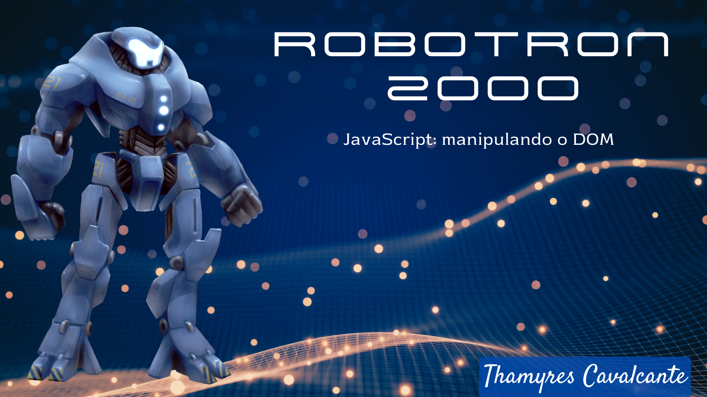

| :placard: Vitrine.Dev |     |
| -------------  | --- |
| :sparkles: Nome        | **Projeto Robotron-2000**
| :label: Tecnologias | HTML, CSS, JavaScript
| :rocket: URL         | https://github.com/Thamyresmya/Robotron-2000

# Projeto Robotron-2000

 

  <a href="#-tecnologias">Tecnologias</a>&nbsp;&nbsp;&nbsp;|&nbsp;&nbsp;&nbsp;  
  <a href="#-projeto">Projeto</a>&nbsp;&nbsp;&nbsp;|&nbsp;&nbsp;&nbsp;  
  <a href="#-gif">Gif</a>&nbsp;&nbsp;&nbsp;&nbsp;&nbsp;&nbsp;

 

## 🚀 Tecnologias

Esse projeto foi desenvolvido com as seguintes tecnologias:

- HTML
- CSS
- JavaScript
- Git e Github

## 💻 Projeto

Projeto de html e css utilizado para o Curso JavaScript: manipulando o DOM (Document Object Model). Aprendi o grande poder de modificar dinamicamente a estrutura de um documento HTML, utilizando DOM e JavaScript.

 

## 📁 Acesso ao projeto

É possível acessar o projeto através do [Link](https://thamyresmya.github.io/Robotron-2000/)

 

## 📸 Gif

</img>

Me siga nas redes sociais:
- [Linkedin](https://www.linkedin.com/in/thamyrescavalcante/)
- [Instagran](https://www.instagram.com/thamyres__cavalcante/)

 

---

Feito com ♥ by Thamyres Cavalcante.v